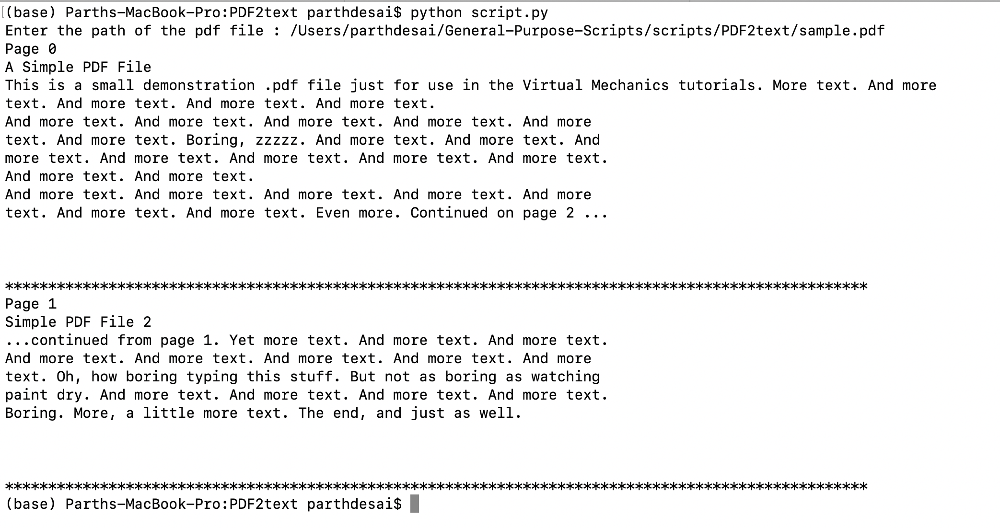

## PDF2text

  &nbsp; &nbsp; 


### About

A Python script to extract text from pdf file.

### Setup

* Install Python3 for Windows from [here](https://python.org).
* Open Windows Command Prompt
* Clone the repository
  ```bash
  git clone https://github.com/GDSC-RCCIIT/General-Purpose-Scripts.git
  ```
* Navigate inside the ```scripts\PDF2text``` directory.
  ```bash
  cd General-Purpose-Scripts\scripts\PDF2text
  ```
* Run using Python
  ```bash
  pip install -r requirements.txt
  python script.py
  ```

### Working Screenshot

=> On execution, script prompts to enter the pdf file path and will extract all text from the file and diplay it thereafter!
<hr>


<hr>
