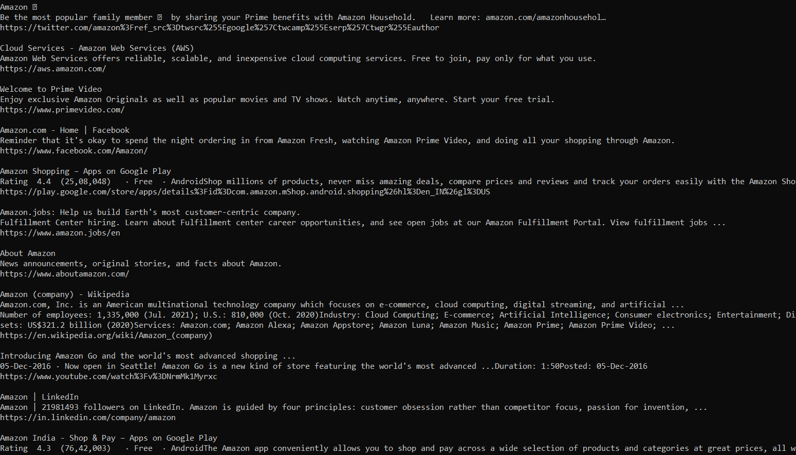

# Python Web Scraper

## About

A python script which returns' google searches and gives you titles, description and links to those searches.

## Setup

- Install Python3 for Windows.
- Open Windows Command Prompt.
- git clone https://github.com/GDSC-RCCIIT/General-Purpose-Scripts.git.
- Navigate inside the cd General-Purpose-Scripts/scripts/Web_Scrapper directory.
- Run using

```
pip install -r requirements.txt
python web_scraper.py

```

## Setup

- Script will ask for input: Enter whatever you want to search eg. Amazon
  
  
