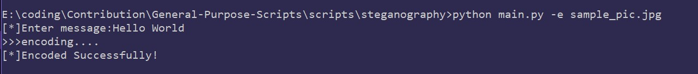
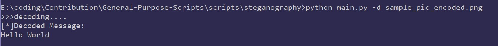

# <b>Steganography<b>

## <ins>Installation</ins>
  1. Clone the repository to your local system
  2. Naviagate to the folder and run
  `pip install -r requirements.txt`  

## <ins>Usage</ins>
   Syntax: `python main.py [-m] [file_name]` 
   -m -> -e or encode to Encode, -d or decode to Decode 
    file_name -> Name of the image you wish to encode or decode
      
1. <ins>To Encode </ins>
        Eg : `python main.py -e sample_pic.jpg`  
        After this you will be asked to enter the message: 
        `[*]Enter your Message: `  
        After successful completion of encoding, a file with syntax `file_name_encode.png` will be created.  
        Eg : `sample_pic_encoded.png` 
        This image file conatins the message.
      
2. <ins>To decode </ins>
    Eg:`python main.py -d sample_pic_encoded.png`  
    After successful completion of decoding,The Decoded message will be visible on the terminal.

## <ins>DEMO</ins>

