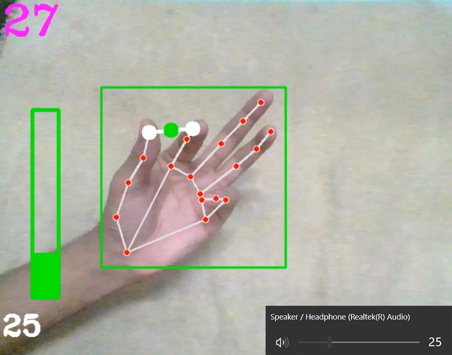
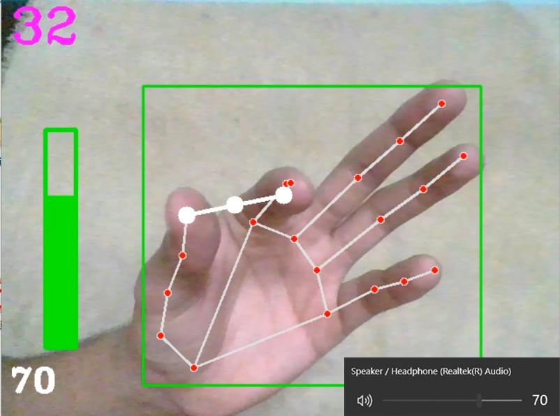

# CONTROL SYSTEM VOLUME BY HAND GESTURE
Simple GUI for users to control volume of control systems

[](https://github.com/psf/black)


## OPERATING INSTRUCTIONS
* install packages as mentioned in ```requirements.txt```
* Run ```main.py``` file which accesses primary camera of the system. 
* The script recognises various hand landmarks.
* The virtual volume bar is situated between the thumb tip and index finger tip
* Increase or decrease distance between these finger tips to adjust the volume bar.
* Bring the little finger down to set the volume.
* To exit the program, press `Q`

## SCREENSHOTS



To run the program, write the following code in the terminal

    python main.py

The program is up and running